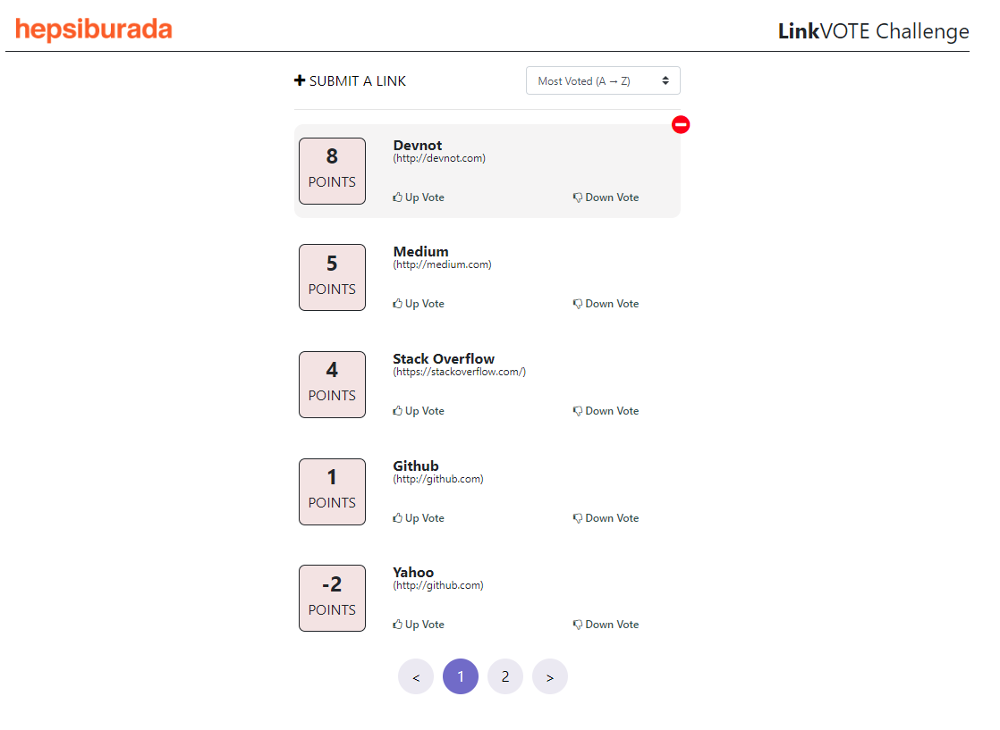
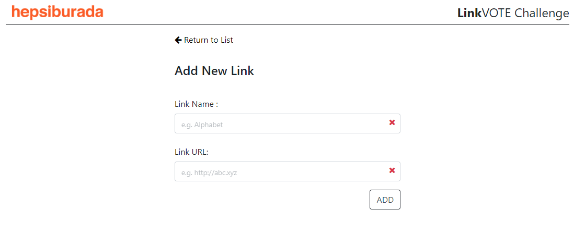
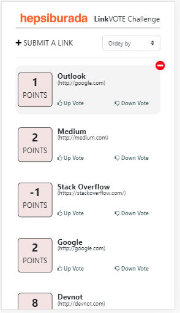
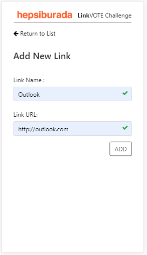

# Vote App Challenge

This project was generated with [Angular CLI](https://github.com/angular/angular-cli) version 8.3.17.

## [Live Demo with Heroku](https://voteapp-challenge.herokuapp.com/)

## Download Project 

> git clone https://github.com/yasinarga/voteApp-Angular8.git

> git pull origin master

> npm install

> npm start

### Home Page
 
 
### Add Link
 
 
 
 ## Mobile Responsive Design
  

## Development server

Run `ng serve`  or  `npm start` for a dev server. Navigate to `http://localhost:4200/`. The app will automatically reload if you change any of the source files.

## Running unit tests

Run `ng test` to execute the unit tests via [Karma](https://karma-runner.github.io).

